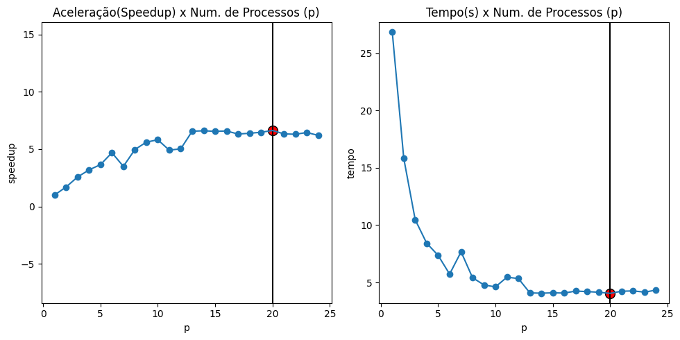

# Cálculo da Aceleração (speedup) e Eficiência da Computação Paralela Para Processo de Treinamento de classificador SVM

---

Este repositório contém um caderno jupyter que tem por objetivo calcularmos a aceleração (*speedup*) e eficiência de uma operação quando executada em paralelo. 

Utilizaremos como exemplo uma operação que consiste no processo de otimização de modelos de aprendizado de máquina. Inicialmente carregamos o conjunto de dados `Breast Cancer`, da biblioteca scikit learn, e em seguida, dividimos esses dados em conjuntos distintos para treinamento e teste. Definimos os hiperparâmetros, como o parâmetro de regularização e o tipo de kernel, juntamente com suas possíveis variações em um grid (param_grid). Criamos um classificador SVM (SVC) e utilizamos o objeto GridSearchCV para explorar sistematicamente as combinações de hiperparâmetros, empregando a validação cruzada para avaliar o desempenho. 

Ao término, recuperamos os hiperparâmetros ótimos e o melhor estimador com base nos resultados do grid search. 

Com esses melhores parâmetros em mãos, procedemos à avaliação do modelo no conjunto de teste. O GridSearchCV automatiza a busca exaustiva de hiperparâmetros e oferece o conjunto ideal para ajustar o modelo, aprimorando, assim, seu desempenho.

Ao empregar o GridSearchCV em um ambiente com múltiplos threads, é possível avaliar o speedup e a eficiência do processo de busca de hiperparâmetros. O speedup representa a aceleração obtida com o paralelismo, medindo a redução no tempo de execução à medida que mais threads são usados. A eficiência, por outro lado, indica o quão bem o processamento paralelo está sendo aproveitado, considerando a relação entre o número de threads e o speedup alcançado. Ao monitorar essas métricas, os profissionais de dados podem determinar o impacto da paralelização na eficiência do GridSearchCV, garantindo que os recursos computacionais sejam utilizados de forma otimizada e resultem em economia de tempo significativa

## Escopo

Este trabalho se concentra na avaliação do impacto do processamento paralelo, excluindo detalhes específicos sobre o aprendizado de máquina. A pesquisa explora o uso de múltiplos threads para analisar como elas podem aprimorar a aceleração e eficiência da operação do processo de treinamento do modelo de aprendizado de máquina utilizado.

## Resultados

Analisamos o impacto da variação no número de processos em relação ao desempenho no treinamento de um modelo de classificação baseado na base de dados Breast Cancer. Os resultados revelaram um aumento inicial na aceleração à medida que o número de processos aumentou, indicando uma melhoria no desempenho. No entanto, a partir de 20 processos, a aceleração diminuiu, sugerindo uma escalabilidade limitada. Ao mesmo tempo, o tempo de execução inicialmente diminuiu à medida que mais processos foram alocados, mas, a partir de 20 processos, começou a aumentar. É possível que isso ocorra devido ao overhead de comunicação e ineficiências na paralelização, limitando os ganhos possíveis com a paralelização no processo de treinamento do modelo de classificação utilizado, conforme preconiza a Lei de Amdahl.

# Arquivos

* `./notebooks/speedup-and-efficiency.ipynb`: caderno jupyter com os passos do experimento;
* `./data/experimento_resultado.csv`: arquivo com os resultados do experimento;
* `./reports/figures/`: pasta com resultados gerados.

# Licença

Distribuída sob licença MIT. Veja o arquivo LICENSE.txt para maiores informações.

# Contato

Antonio Alisio de Meneses Cordeiro

